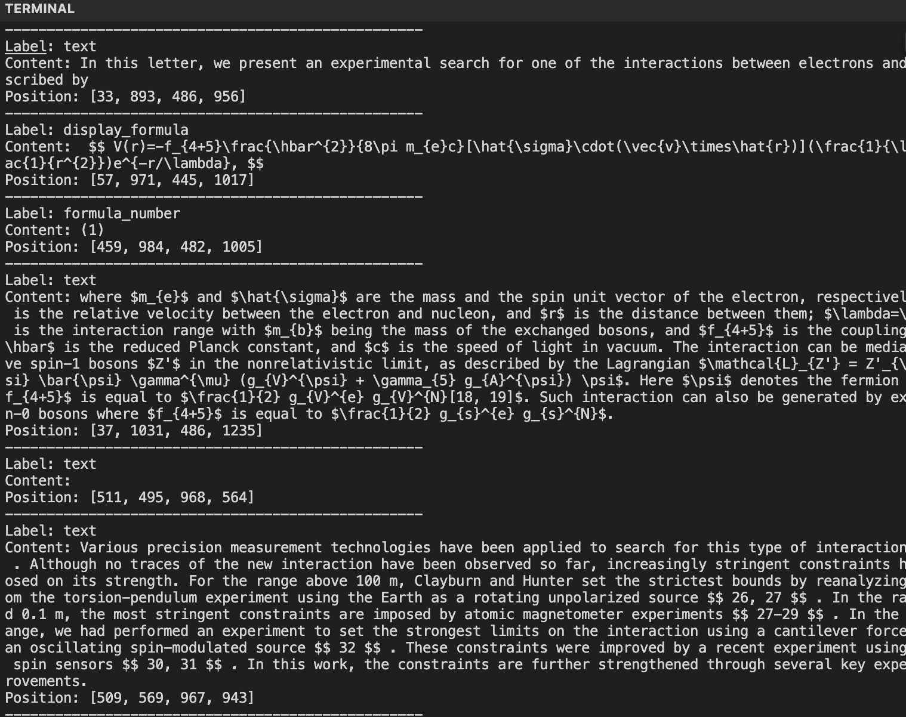
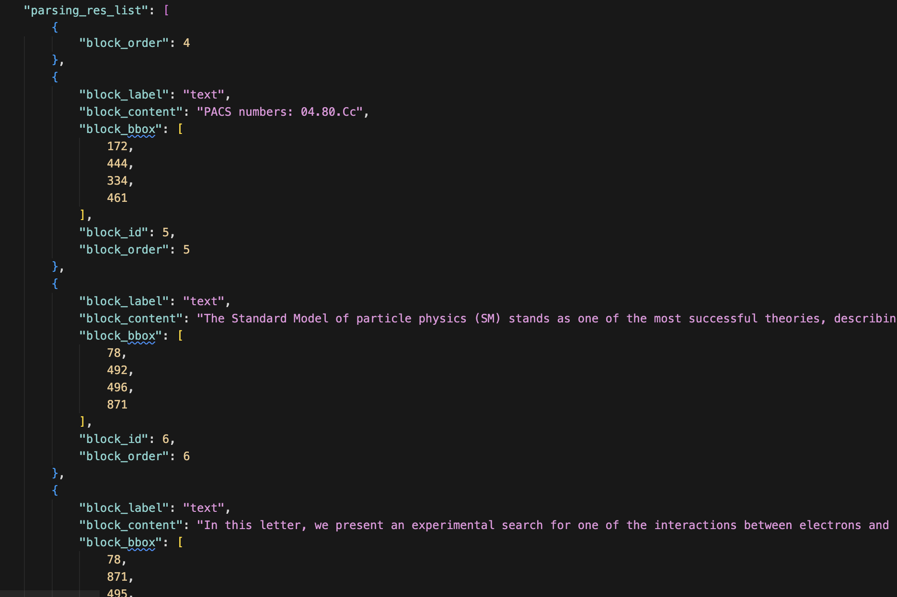
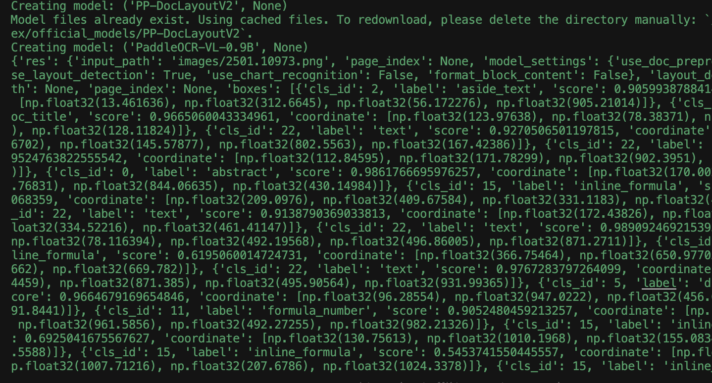
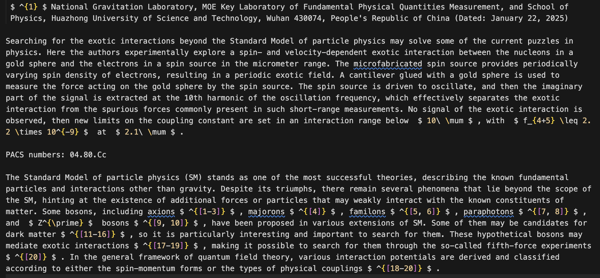

[English](README.md) | [繁體中文](README.zh-Hant.md) | [粵語](README.yue.md)

> **Foreword**: This project was born out of the difficulties I encountered while reading the official documentation. I spent a lot of time researching and experimenting to figure out these methods. To save others from going down the same winding paths, I've compiled my findings into these simple scripts and this note. If you happen to come across it, I hope it helps!

This guide will walk you through the purpose of each file in a relaxed, handwritten-note style.

## 

---

## ⚙️ Setup

Before you run any scripts, you need to do two things: start the backend AI model server and set up your Python environment.

### Step 1: Start the vLLM Inference Server (with Docker)

Our scripts need a powerful backend for the actual text recognition, which is accelerated by vLLM. The easiest way to get it running is with Docker.

**Prerequisites**: You need [Docker](https://www.docker.com/) installed and an NVIDIA graphics card (with the appropriate drivers).

Open your terminal and paste the following command:

For Apple Silicon CPU:

```bash
docker run --rm --name paddleocr-vllm  --ipc=host --shm-size=13g -p 8111:8555 thauter/paddleocr-vl-vllm:cpu
```

For GPU #cuda:

```bash
docker run -d -p 8111:8111 --gpus all --name paddleocr-vllm-server ccr-2vdh3abv-pub.cnc.bj.baidubce.com/paddlepaddle/paddleocr-genai-vllm-server:latest paddleocr genai_server --model_name PaddleOCR-VL-0.9B --host 0.0.0.0 --port 8111 --backend vllm
```

**Important Note**:

- We use `--port 8111` in the command above because all Python scripts in this project are configured to connect to this port.
- If you want to use a different port, remember to change both the `--port` in the command **and** the `vl_rec_server_url` in all `.py` files.
- After running this command, do not close the terminal; let it continue running in the background.

### Step 2: Prepare the Python Environment (with uv)

This project uses `uv`, a fast Python package manager.

1.  **Create a Virtual Environment**:
    We specify Python 3.10. In the project root directory, run:

    ```bash
    uv venv --python 3.10
    ```

    `uv` will create a folder named `.venv` containing a clean Python environment.

2.  **Install All Packages**:
    Next, use the `sync` command. `uv` will automatically install all required packages based on the `pyproject.toml` and `uv.lock` files.
    ```bash
    uv sync
    ```

Once you've completed these two steps, you're ready to start using the scripts!

---

## Project Structure Overview

```
.
├── images/             # Place all images you want to recognize here
│   └── 2501.10973.png  # Example image
├── pdfs/               # Place all PDF files you want to recognize here
│   └── sample.pdf      # Example PDF
├── output_data/        # Script-generated output will be stored in folders like this
├── pyproject.toml      # Project configuration file
├── baseOcr_output.py   # [Basic] Recognizes a single image, prints result to console
├── All_file_Ocr.py     # [Advanced] Batch processes all images in a folder
├── All_res_Ocr.py      # [Powerhouse] Detailed processing for a single image with many output options
├── Batch_PDF_Processor.py # [PDF] Batch processes PDFs using the command line
└── Batch_Pdf_Ocr.py    # [PDF Powerhouse] Batch processes PDFs with Python for page-by-page analysis
```

---

## Script Functionality Explained

Let's go through what each script does!

### 👶 `baseOcr_output.py` - Beginner's Taster

This is the most basic script.

- **Function**: It reads a specified image (`images/2501.10973.png`), recognizes it with the OCR engine, and directly **prints the result to your terminal (command line)**.
- **Use Case**:
  - Quickly testing if the environment is set up correctly.
  - Seeing the basic recognition effect of OCR on a particular image.
- **How to Use**: Simply run `uv run python baseOcr_output.py`.

---

### 🗂️ `All_file_Ocr.py` - Image Batch Processor

Use this when you have a whole folder of images to process.

- **Function**: It goes into the `images/` folder and performs OCR on **all images** (png, jpg, jpeg) one by one. The results are saved as **JSON** and **Markdown** formats in the `output2/` folder.
- **Use Case**:
  - When you have dozens or even hundreds of images to convert to text at once.
  - You don't need complex settings and just want to get the results quickly.
- **How to Use**: Run `uv run python All_file_Ocr.py`, then check the `output2/` folder for the results.

---

### 🔬 `All_res_Ocr.py` - Fine-grained Image Analyzer

This script offers the most control for processing a single image.

- **Function**: Like `baseOcr_output.py`, it processes a single image. However, it provides several **switches** for you to configure:
  - `SAVE_JSON`: Choose whether to save a JSON file.
  - `SAVE_MARKDOWN`: Choose whether to save a Markdown file.
  - `BLOCK_TEXT_SAVE_MODE`: This is the most special feature. You can choose how to save text blocks:
    - `'none'`: Don't save.
    - `'separate'`: Each text block (e.g., a title, a paragraph) is saved as a separate `.txt` file.
    - `'single'`: All text blocks from the entire image are saved sequentially into a **single** `.txt` file.
- **Use Case**:
  - For in-depth analysis of an image's layout structure.
  - When you only need plain text or only the JSON output.
  - For experimenting to see the output with different settings.
- **How to Use**: Before running, open the file to modify the switches, then run `uv run python All_res_Ocr.py`.

---

### 📜 `Batch_PDF_Processor.py` - PDF Command-Line Processor

This script is designed for those who prefer using the command line to process PDFs.

- **Function**: It scans for all PDFs in the `pdfs/` folder. Then, it mimics manually typing commands in the terminal, executing the `paddleocr doc_parser` command for each PDF. The results for each PDF are stored in a subdirectory with the same name under `output_cli/`.
- **Use Case**:
  - If you're accustomed to using command-line tools.
  - You want to integrate OCR functionality into your existing shell scripts or automation workflows.
- **How to Use**: Place your PDFs in the `pdfs/` folder and run `uv run python Batch_PDF_Processor.py`.

---

### 👑 `Batch_Pdf_Ocr.py` - Almighty PDF Processor

This is the most comprehensive and powerful script for processing PDFs.

- **Function**: Like the previous script, it processes all PDFs in the `pdfs/` folder. However, instead of using the command line, it uses the Python library directly, allowing for finer control. It will:
  1.  Read PDF files one by one.
  2.  Analyze them **page by page**.
  3.  For each page, just like in `All_res_Ocr.py`, you can freely choose whether to save **JSON**, **Markdown**, and how to save **text blocks** (`BLOCK_TEXT_SAVE_MODE`).
  4.  The results are stored systematically in `output_pdfs/`, with a folder for each PDF, and a subfolder for each page within it.
- **Use Case**:
  - When you need a detailed analysis of each page of a PDF.
  - You want the most complete and flexible output results.
- **How to Use**: Open the file to configure the settings, place your PDFs in the `pdfs/` folder, and then run `uv run python Batch_Pdf_Ocr.py`.

---

## Summary

Hope this handwritten-note style guide was helpful!
